# Simple Image Annotation App

A simple image upload and annotation app. Made with [ReactJS](https://reactjs.org/docs/create-a-new-react-app.html), [Flask](https://flask.palletsprojects.com/en/2.0.x/) and [PyMongo](https://pymongo.readthedocs.io/en/stable/).

# How To Setup This App

## Required installs

1. Ensure [MongoDB Server v5.0.5+](https://www.mongodb.com/try/download/community) is installed and running on default port `27017`.
2. Ensure [NodeJS v16+](https://nodejs.org/en/) is installed.
3. Ensure [Python v10+](https://www.python.org/) is installed.
4. To install all NodeJS dependencies, open a Command window on the root folder and execute the following command:
	```
	$ npm install
	```
5. To install all Python dependencies, open a Command window on the root folder and execute the following command:
	```
	$ cd server
	$ pip install -r requirements.txt
	```

## Host and run app

1. Start the server and client hosting by double-clicking the `run-server.bat` file.
   - Alternatively, open a Command window on the root folder and execute the following command:
		```
		$ cd server
		$ python api.py
		```
2. The app can be accessed at [http://localhost:3001](http://localhost:3001)

## Rebuilding the client

If you wish to modify the React app:
1. Edit the files in `src`
2. Open a Command window on the root folder and execute the following command:
	```
	$ npm run build
	```
3. Client-side source files will be compiled and a `build` folder will be created / updated with the current version of the React app

# How To Use This App

## User registration

First-time visitors to the app will greeted by the registration page.

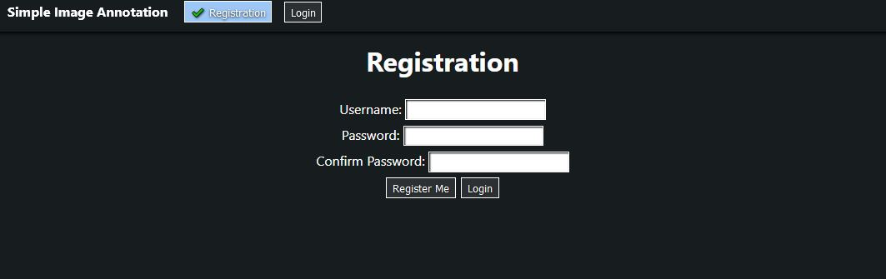

Enter your desired username (alphanumeric characters only) and password.

Re-enter your password to confirm it.

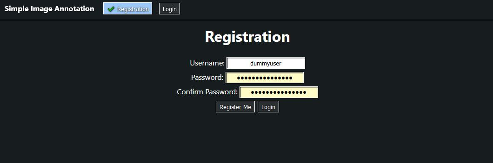

Click on the `Register Me` button to complete the registration. If successful, you will be brought to your personal projects page.

---

## User login

First-time visitors to the app will greeted by the registration page.

Click on the `Login` button to navigate to the user login page.

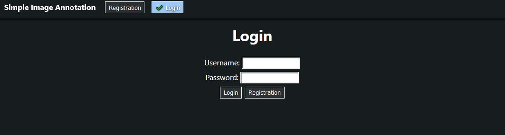

Enter your username and password.

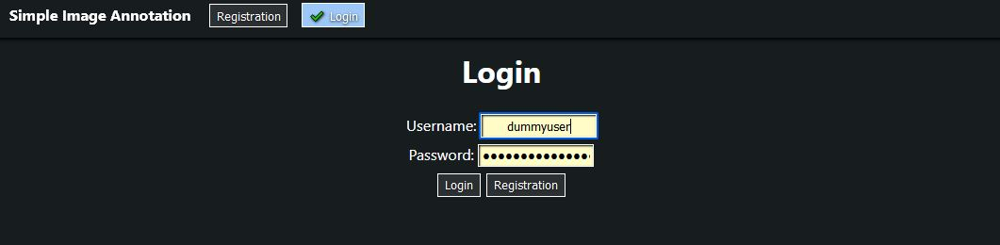

Click on the `Login` button to complete the login. If successful, you will be brought to your personal projects page.

*If your user credentials are incorrect, simply re-enter the correct credentials.*

---

## User logout

If you are logged in, the `Logout` button can be found on the top navigation panel.

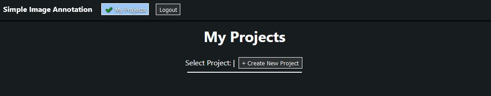

Click on the `Logout` button to logout.

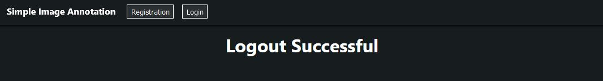

---

## User create new project

If you are logged in, the `+ Create New Project` button can be found below the `My Projects` page title.

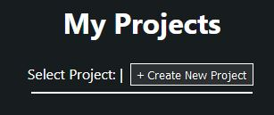

Click on the button and a page prompt will appear. Type in your desired project title and click `OK`.

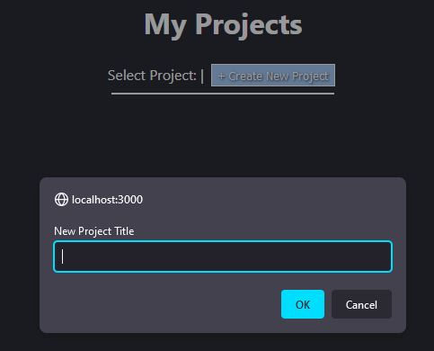

A new project will be created and you will be brought to the empty project page.

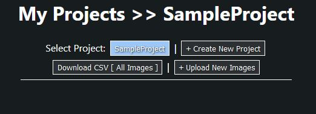

---

## User select an existing project

If you are logged in, the buttons for your existing project can be found below the `My Projects` page title.

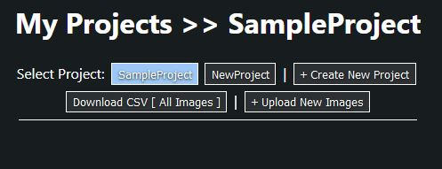

Click on your desired project button and you will be navigated to that project's page.

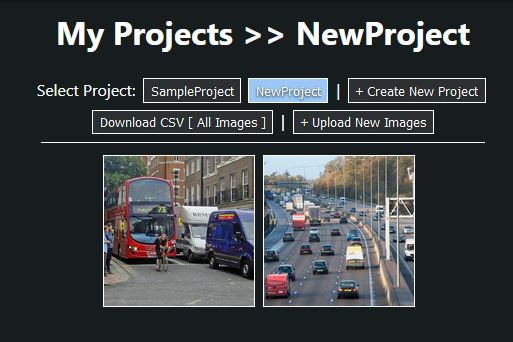

---

## User upload images

If you are logged in and have created at least one existing project, the `+ Upload New Images` button can be found below the `My Projects` page title.


Click on the button and an upload window will appear. Select the images you want to upload to the project and click `Open`.

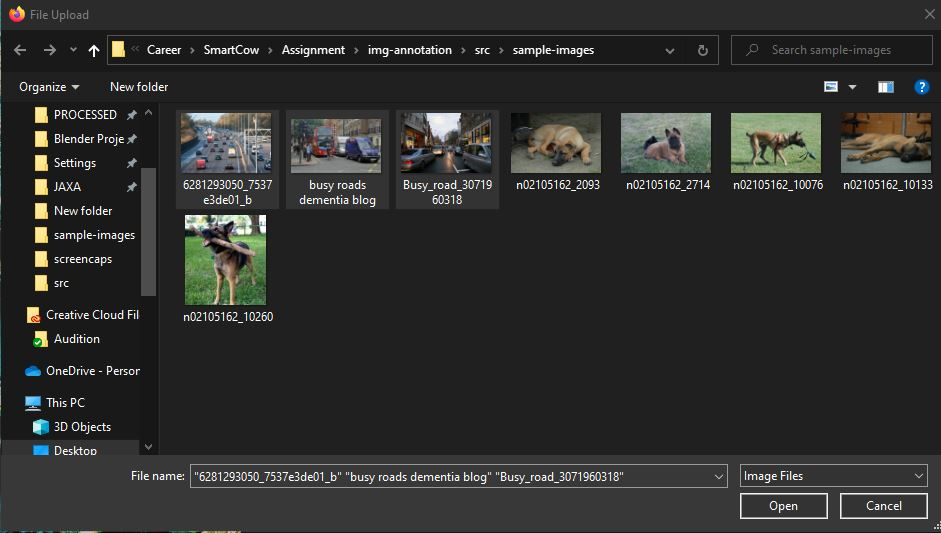

If successful, new images will be displayed automatically. Otherwise, re-click on the project button to refresh the page.

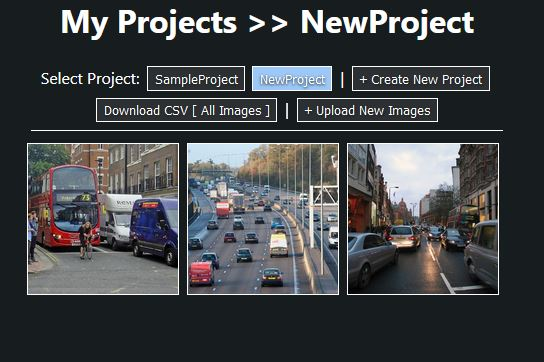

---

## User annotate images

If you are logged in, have created at least one existing project, and have uploaded at least one image, the images for the currently selected project will be displayed.


Click on an image you desire to annotate. A full-sized image will pop up.

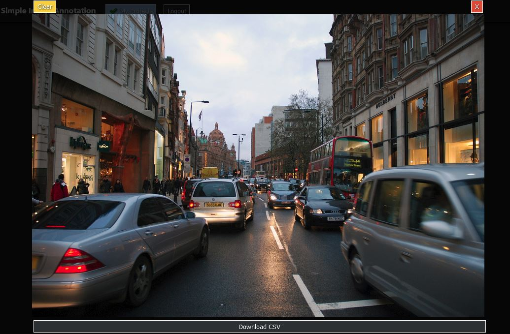

Click and drag across a feature of the image. A dropdown menu will appear. Select the category that best represents the feature.

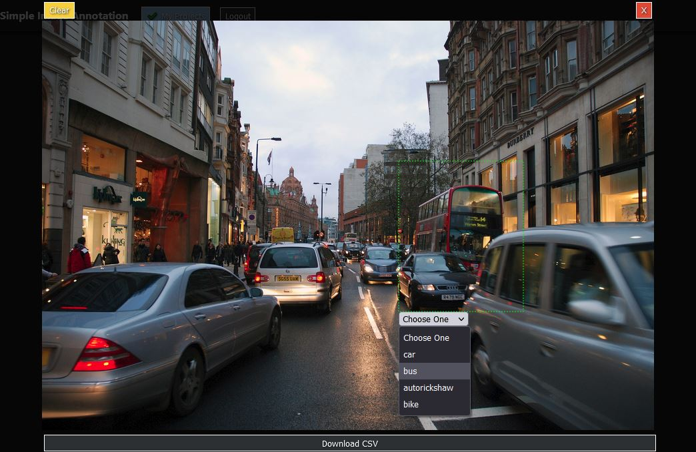

Once complete, the feature will be labelled on the image.

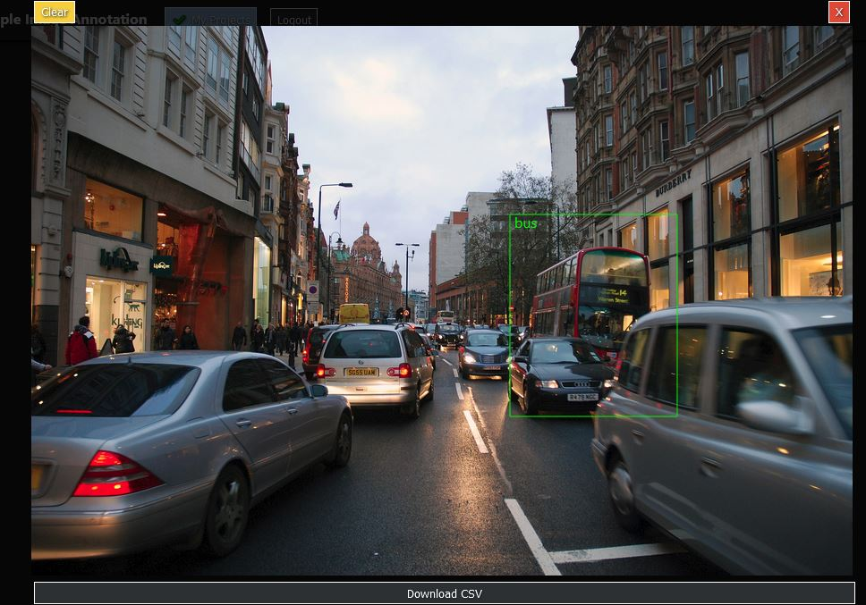

---

## User download image annotation data

Annotated images can be identified by a solid yellow border. Non-annotated images have dashed white borders.

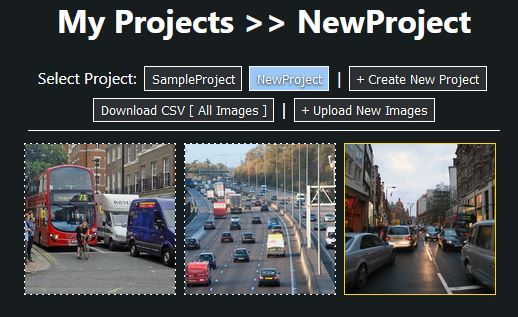

Select an annotated image and click on the `Download CSV` button at the bottom of the full image to download the annotation coordinates.


The downloaded CSV file is structure as follows:

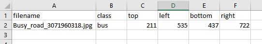

You can also download the entire projects' annotation data by clicking on the `Download CSV [ All Images ]` button the project's page.


# External Libraries Used

The following NodeJS libraries were used to support the functions of the app:

## Client-side
- [styled-components](https://styled-components.com/)
- [sheetjs](https://sheetjs.com/)
- [react-router](https://reactrouter.com/)

## Server-side
- [flask](https://flask.palletsprojects.com/en/2.0.x/)
- [pymongo](https://pymongo.readthedocs.io/en/stable/)